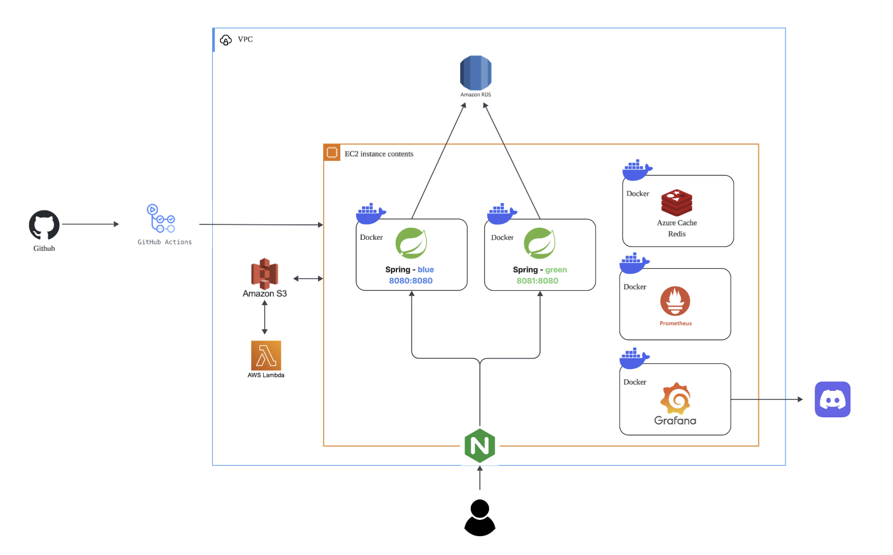
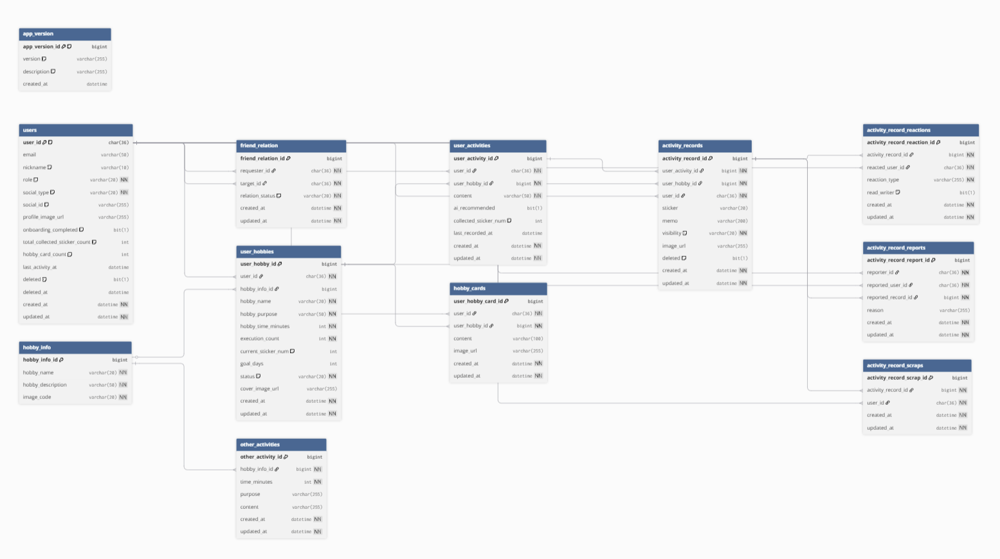

# ForDay_Server: 당신의 취미, 66일을 함께 채워나가요.

## 📜 프로젝트 문서 ➡️ [ForDay Server Wiki](https://github.com/Central-MakeUs/ForDay_Server/wiki)

 

## 🛠 기술 스택

- **Backend**  
  
  
  -59666C?style=for-the-badge&logo=hibernate&logoColor=white)
  

- **Infra**  
  
  
  
  
  

- **AI**  
  
  

- **DB**  
  
  

 

## 🌍 아키텍처 구조

 

## 📝 ERD 설계

 

## ✅ 이슈 · 커밋 · 브랜치 전략

### ✔️ 이슈, 커밋, 브랜치명 규칙

- **이슈: `[prefix] 작업내용`**
    - 예: **[feat] 카카오 로그인 구현**

- **브랜치: `[prefix]/#이슈번호-설명`**
    - 예: **feat/#12-kakao-oauth-login**

- **커밋: `[ #이슈번호 ] prefix: 작업내용`**
    - 예: **[#51] feat: 카카오 로그인 에러 해결**

 

| **prefix** | **definition** |
| --- | --- |
| feat | 새로운 기능 추가 |
| fix | 기능 수정 |
| chore | 설정 / 환경 구성 |
| bug | 오류 수정 |
| hotfix | 긴급 수정 |
| refactor | 코드 리팩토링 |
| docs | 문서 작업 |
| test | 테스트 코드 작성 |
| setting | 세팅 관련 코드 |
| deploy | 배포 관련 코드 |

 

### ✔️ 깃 브랜치 전략

- **main** : 운영 환경에 배포되는 최종 코드
- **release** : 개발 환경에 배포되는 코드
- **dev** : 기능 통합 브랜치
- **feat/*** : 단일 기능 개발 브랜치

